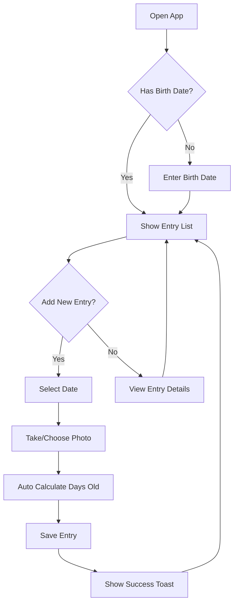

## 1. Product Overview
一款专为新手父母设计的婴儿头型变化记录应用，帮助家长追踪宝宝头型发育情况，记录成长点滴。

## 2. Core Features

### 2.1 User Roles
| Role | Registration Method | Core Permissions |
|------|---------------------|------------------|
| Parent | None (local storage) | Record, view, edit head shape entries |

### 2.2 Feature Module
1. **Home Page**: Display list of recorded entries, quick add button
2. **Add Entry Page**: Record date, upload photo, calculate days old automatically

### 2.3 Page Details
| Page Name | Module Name | Feature description |
|-----------|-------------|---------------------|
| Home Page | Entry List | Display all recorded entries with photo thumbnails and days old |
| Home Page | Quick Add | Floating action button to add new entry |
| Add Entry Page | Date Picker | Select recording date |
| Add Entry Page | Photo Upload | Capture photo or select from gallery |
| Add Entry Page | Age Calculator | Auto-calculate days old based on birth date |
| Add Entry Page | Save | Save entry with success notification |

## 3. Core Process

## 4. User Interface Design

### 4.1 Design Style
- Primary color: Soft mint green (#4ECDC4) - calming, natural feel
- Secondary color: Warm peach (#FF6B6B) - gentle accent
- Button style: Rounded corners (16px), soft shadows
- Font: San Francisco (iOS native) / Roboto (fallback)
- Layout: Card-based, clean minimal design
- Icons: Simple line icons, friendly and approachable

### 4.2 Page Design Overview
| Page Name | Module Name | UI Elements |
|-----------|-------------|-------------|
| Home Page | Header | Title "宝宝头型记录", birth date display |
| Home Page | Entry Cards | Photo thumbnail, date, days old badge |
| Home Page | FAB | Circular button with plus icon |
| Add Entry Page | Date Section | Date picker with today shortcut |
| Add Entry Page | Photo Section | Camera icon, gallery icon, preview area |
| Add Entry Page | Age Display | Large text showing days old |
| Add Entry Page | Save Button | Prominent primary color button |

### 4.3 Responsiveness
- Mobile-first design, optimized for iPhone screens
- Touch-friendly button sizes (minimum 44px)
- Responsive layout for different screen sizes

### 4.4 Accessibility
- High contrast text
- Screen reader support
- Large touch targets## 1## 1. Product Overview
婴儿头型记录应用，帮助家长追踪宝宝头型发育，记录成长## 1. Product Overview
婴儿头型记录应用，帮助家长追踪宝宝头型发育，记录成长变化。

## 2. Core Features

### 2.1 User Roles
| Role## 1. Product Overview
婴儿头型记录应用，帮助家长追踪宝宝头型发育，记录成长变化。

## 2. Core Features

### 2.1 User Roles
| Role | Registration | Permissions |
|------|## 1. Product Overview
婴儿头型记录应用，帮助家长追踪宝宝头型发育，记录成长变化。

## 2. Core Features

### 2.1 User Roles
| Role | Registration | Permissions |
|------|--------------|-------------|
| 用户 | 无需## 1. Product Overview
婴儿头型记录应用，帮助家长追踪宝宝头型发育，记录成长变化。

## 2. Core Features

### 2.1 User Roles
| Role | Registration | Permissions |
|------|--------------|-------------|
| 用户 | 无需注册 | 记录、查看头型数据 |

### 2.2 Feature Module
1## 1. Product Overview
婴儿头型记录应用，帮助家长追踪宝宝头型发育，记录成长变化。

## 2. Core Features

### 2.1 User Roles
| Role | Registration | Permissions |
|------|--------------|-------------|
| 用户 | 无需注册 | 记录、查看头型数据 |

### 2.2 Feature Module
1. **首页**: 展示记录列表、快速添加入口
2. **添加记录页**:## 1. Product Overview
婴儿头型记录应用，帮助家长追踪宝宝头型发育，记录成长变化。

## 2. Core Features

### 2.1 User Roles
| Role | Registration | Permissions |
|------|--------------|-------------|
| 用户 | 无需注册 | 记录、查看头型数据 |

### 2.2 Feature Module
1. **首页**: 展示记录列表、快速添加入口
2. **添加记录页**: 选择日期、上传照片、自动计算日龄、保存

### 2.3 Page## 1. Product Overview
婴儿头型记录应用，帮助家长追踪宝宝头型发育，记录成长变化。

## 2. Core Features

### 2.1 User Roles
| Role | Registration | Permissions |
|------|--------------|-------------|
| 用户 | 无需注册 | 记录、查看头型数据 |

### 2.2 Feature Module
1. **首页**: 展示记录列表、快速添加入口
2. **添加记录页**: 选择日期、上传照片、自动计算日龄、保存

### 2.3 Page Details
| Page | Module | Feature |
## 1. Product Overview
婴儿头型记录应用，帮助家长追踪宝宝头型发育，记录成长变化。

## 2. Core Features

### 2.1 User Roles
| Role | Registration | Permissions |
|------|--------------|-------------|
| 用户 | 无需注册 | 记录、查看头型数据 |

### 2.2 Feature Module
1. **首页**: 展示记录列表、快速添加入口
2. **添加记录页**: 选择日期、上传照片、自动计算日龄、保存

### 2.3 Page Details
| Page | Module | Feature |
|------|--------|---------|
|## 1. Product Overview
婴儿头型记录应用，帮助家长追踪宝宝头型发育，记录成长变化。

## 2. Core Features

### 2.1 User Roles
| Role | Registration | Permissions |
|------|--------------|-------------|
| 用户 | 无需注册 | 记录、查看头型数据 |

### 2.2 Feature Module
1. **首页**: 展示记录列表、快速添加入口
2. **添加记录页**: 选择日期、上传照片、自动计算日龄、保存

### 2.3 Page Details
| Page | Module | Feature |
|------|--------|---------|
| 首页 | 记录列表 | 显示所有记录项，含照片缩略图和日龄 |## 1. Product Overview
婴儿头型记录应用，帮助家长追踪宝宝头型发育，记录成长变化。

## 2. Core Features

### 2.1 User Roles
| Role | Registration | Permissions |
|------|--------------|-------------|
| 用户 | 无需注册 | 记录、查看头型数据 |

### 2.2 Feature Module
1. **首页**: 展示记录列表、快速添加入口
2. **添加记录页**: 选择日期、上传照片、自动计算日龄、保存

### 2.3 Page Details
| Page | Module | Feature |
|------|--------|---------|
| 首页 | 记录列表 | 显示所有记录项，含照片缩略图和日龄 |
| 首页 | 添加按钮 | 浮动## 1. Product Overview
婴儿头型记录应用，帮助家长追踪宝宝头型发育，记录成长变化。

## 2. Core Features

### 2.1 User Roles
| Role | Registration | Permissions |
|------|--------------|-------------|
| 用户 | 无需注册 | 记录、查看头型数据 |

### 2.2 Feature Module
1. **首页**: 展示记录列表、快速添加入口
2. **添加记录页**: 选择日期、上传照片、自动计算日龄、保存

### 2.3 Page Details
| Page | Module | Feature |
|------|--------|---------|
| 首页 | 记录列表 | 显示所有记录项，含照片缩略图和日龄 |
| 首页 | 添加按钮 | 浮动按钮快速进入添加页面 |
| 添加页## 1. Product Overview
婴儿头型记录应用，帮助家长追踪宝宝头型发育，记录成长变化。

## 2. Core Features

### 2.1 User Roles
| Role | Registration | Permissions |
|------|--------------|-------------|
| 用户 | 无需注册 | 记录、查看头型数据 |

### 2.2 Feature Module
1. **首页**: 展示记录列表、快速添加入口
2. **添加记录页**: 选择日期、上传照片、自动计算日龄、保存

### 2.3 Page Details
| Page | Module | Feature |
|------|--------|---------|
| 首页 | 记录列表 | 显示所有记录项，含照片缩略图和日龄 |
| 首页 | 添加按钮 | 浮动按钮快速进入添加页面 |
| 添加页 | 日期选择 | 选择记录日期，默认今天 |
| 添加页 | 照片## 1. Product Overview
婴儿头型记录应用，帮助家长追踪宝宝头型发育，记录成长变化。

## 2. Core Features

### 2.1 User Roles
| Role | Registration | Permissions |
|------|--------------|-------------|
| 用户 | 无需注册 | 记录、查看头型数据 |

### 2.2 Feature Module
1. **首页**: 展示记录列表、快速添加入口
2. **添加记录页**: 选择日期、上传照片、自动计算日龄、保存

### 2.3 Page Details
| Page | Module | Feature |
|------|--------|---------|
| 首页 | 记录列表 | 显示所有记录项，含照片缩略图和日龄 |
| 首页 | 添加按钮 | 浮动按钮快速进入添加页面 |
| 添加页 | 日期选择 | 选择记录日期，默认今天 |
| 添加页 | 照片上传 | 拍照或从相册选择图片 |
| 添加页 | 日龄计算 |## 1. Product Overview
婴儿头型记录应用，帮助家长追踪宝宝头型发育，记录成长变化。

## 2. Core Features

### 2.1 User Roles
| Role | Registration | Permissions |
|------|--------------|-------------|
| 用户 | 无需注册 | 记录、查看头型数据 |

### 2.2 Feature Module
1. **首页**: 展示记录列表、快速添加入口
2. **添加记录页**: 选择日期、上传照片、自动计算日龄、保存

### 2.3 Page Details
| Page | Module | Feature |
|------|--------|---------|
| 首页 | 记录列表 | 显示所有记录项，含照片缩略图和日龄 |
| 首页 | 添加按钮 | 浮动按钮快速进入添加页面 |
| 添加页 | 日期选择 | 选择记录日期，默认今天 |
| 添加页 | 照片上传 | 拍照或从相册选择图片 |
| 添加页 | 日龄计算 | 根据出生日期自动计算 |
| 添加页 | 保存功能 | 保存记录并显示成功#### 1. 产品概述
一款专为新手父母设计的婴儿头型变化记录应用，帮助## 1. 产品概述
一款专为新手父母设计的婴儿头型变化记录应用，帮助家长追踪宝宝头型发育情况，记录成长点滴。

## 2. 核心功能## 1. 产品概述
一款专为新手父母设计的婴儿头型变化记录应用，帮助家长追踪宝宝头型发育情况，记录成长点滴。

## 2. 核心功能

### 2.1 用户角色
|## 1. 产品概述
一款专为新手父母设计的婴儿头型变化记录应用，帮助家长追踪宝宝头型发育情况，记录成长点滴。

## 2. 核心功能

### 2.1 用户角色
| 角色 | 注册方式 | 核心权限 |
|------|----------|----------|
## 1. 产品概述
一款专为新手父母设计的婴儿头型变化记录应用，帮助家长追踪宝宝头型发育情况，记录成长点滴。

## 2. 核心功能

### 2.1 用户角色
| 角色 | 注册方式 | 核心权限 |
|------|----------|----------|
| 家长 | 无需注册（本地存储） | 记录、查看、编辑头型## 1. 产品概述
一款专为新手父母设计的婴儿头型变化记录应用，帮助家长追踪宝宝头型发育情况，记录成长点滴。

## 2. 核心功能

### 2.1 用户角色
| 角色 | 注册方式 | 核心权限 |
|------|----------|----------|
| 家长 | 无需注册（本地存储） | 记录、查看、编辑头型记录 |

### 2.2 功能模块
1. **首页**: 显示记录