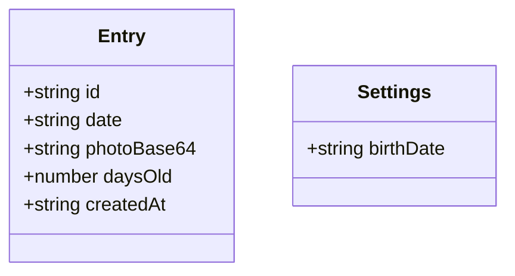

## 1. Architecture Design


## 2. Technology Description
- Frontend: React@18 + TypeScript + tailwindcss@3 + vite
- Initialization Tool: vite-init
- Backend: None (local storage only)
- Database: Browser LocalStorage

## 3. Route Definitions
| Route | Purpose |
|-------|---------|
| / | Home page with entry list |
| /add | Add new entry page |

## 4. Data Model

### 4.1 Data Model Definition


### 4.2 Data Structure
```typescript
interface Entry {
  id: string;
  date: string; // YYYY-MM-DD
  photoBase64: string;
  daysOld: number;
  createdAt: string; // ISO timestamp
}

interface Settings {
  birthDate: string; // YYYY-MM-DD
}
```

### 4.3 Storage Structure
- `entries`: Array of Entry objects (stored as JSON string)
- `settings`: Settings object (stored as JSON string)

## 5. Component Structure
```
src/
├── components/
│   ├── Header.tsx          # App header with title and birth date
│   ├── EntryCard.tsx       # Individual entry display card
│   ├── EntryList.tsx       # List of all entries
│   ├── PhotoUploader.tsx   # Photo capture/upload component
│   ├── DatePicker.tsx      # Date selection component
│   ├── AgeDisplay.tsx      # Days old display
│   └── Toast.tsx           # Success notification
├── pages/
│   ├── HomePage.tsx        # Main entry list page
│   └── AddEntryPage.tsx    # Add new entry page
├── hooks/
│   ├── useStorage.ts       # Local storage utilities
│   └── useAgeCalculator.ts # Age calculation hook
├── types/
│   └── index.ts            # TypeScript type definitions
├── utils/
│   └── helpers.ts          # Helper functions
├── App.tsx                 # Main app component
└── main.tsx                # Entry point
```

## 6. Core Features Implementation

### 6.1 Birth Date Setup
- On first launch, prompt user for baby's birth date
- Store in localStorage under 'settings' key
- Validate date format (YYYY-MM-DD)

### 6.2 Entry Creation
1. Select date (default to today)
2. Capture photo via camera OR select from gallery
3. Auto-calculate days old based on birth date
4. Save entry to localStorage

### 6.3 Photo Handling
- Use HTML5 File API for photo selection
- Convert image to base64 for local storage
- Handle camera capture via input type="file" with accept="image/*"

### 6.4 Age Calculation
- Calculate difference between entry date and birth date
- Return total days as daysOld

### 6.5 Success Notification
- Show toast message on successful save
- Auto-dismiss after 2 seconds

## 7. Dependencies
- react: ^18.2.0
- react-dom: ^18.2.0
- react-router-dom: ^6.14.0
- tailwindcss: ^3.3.0
- lucide-react: ^0.263.0

## 8. iOS Optimization
- Viewport meta tag for mobile scaling
- Touch-action CSS for smooth scrolling
- Camera access via input element
- Responsive design for various iPhone screen sizes